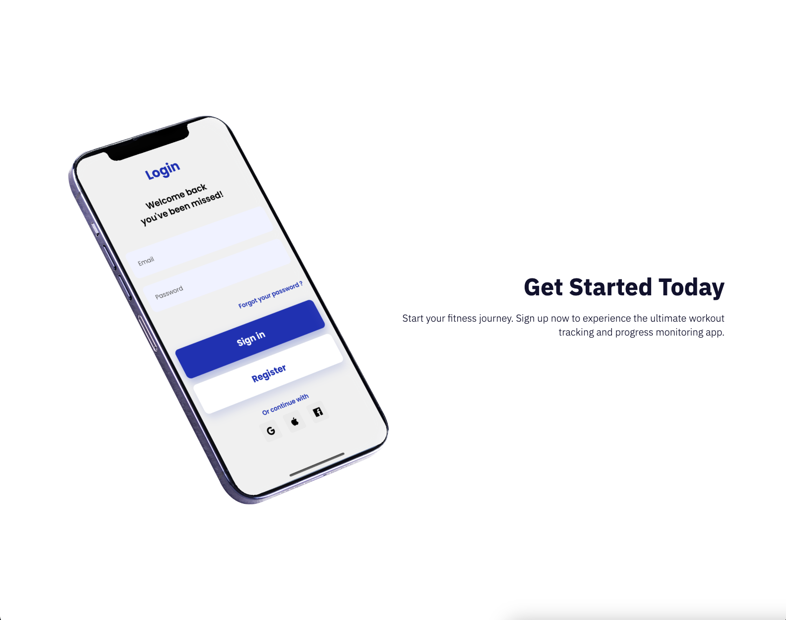
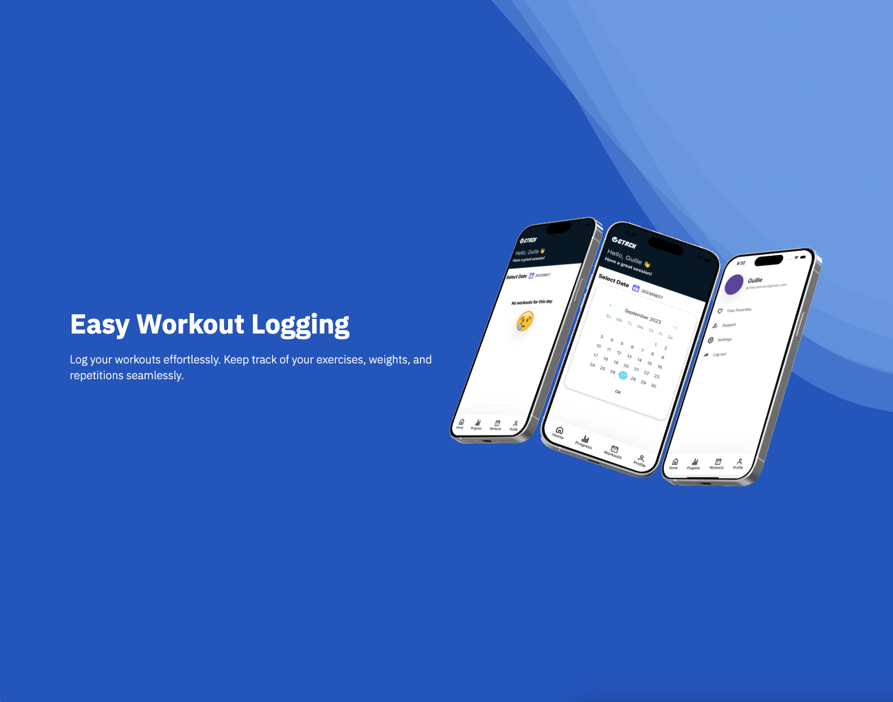
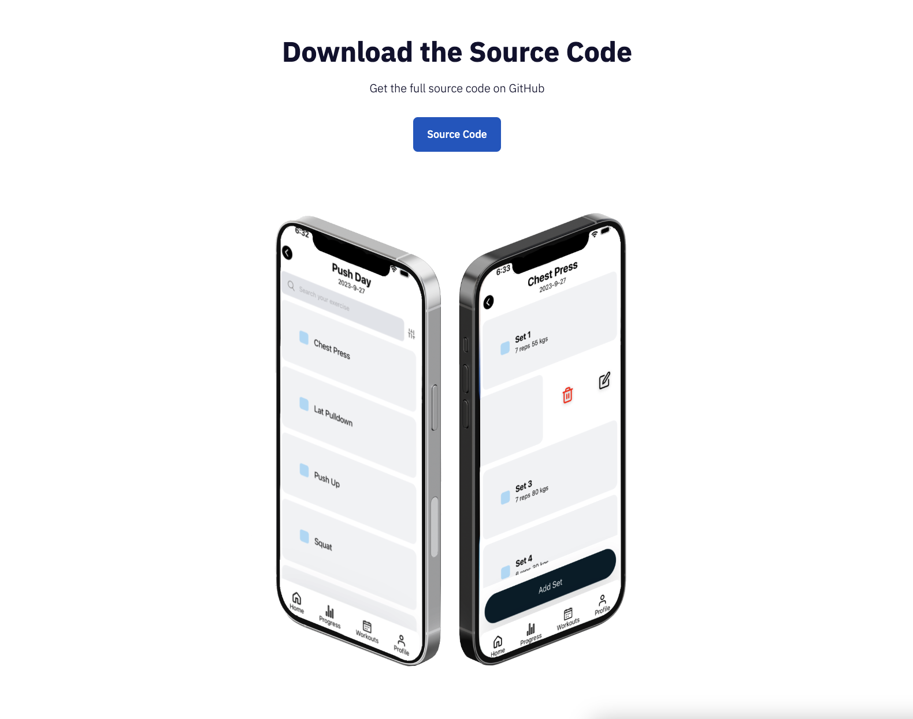

# Gym Tracker App Landing Page

Welcome to the Gym Tracker App landing page repository. This repository hosts the landing page for our Gym Tracker application, which helps users track their workout progress and visualize their fitness journey.

## Overview

The Gym Tracker App is designed to help fitness enthusiasts keep track of their workout sessions and monitor their progress over time. With a user-friendly interface and powerful analytics tools, our app simplifies the process of recording and visualizing your fitness data.

## Screenshots

Here are some screenshots of our landing page:

- 
- 
- 
- 

## Features

- User-friendly dashboard for workout data entry.
- Interactive charts and graphs for progress analysis.
- Detailed statistics and insights to track improvements.
- User account management and data privacy controls.
- Mobile-responsive design for access on all devices.

## Visit Our Website

Explore our Gym Tracker App and start your fitness journey today! Visit our website by clicking the link below:

[**Gym Tracker App - Visit Now**](https://gtrack-landing-page.vercel.app/)

